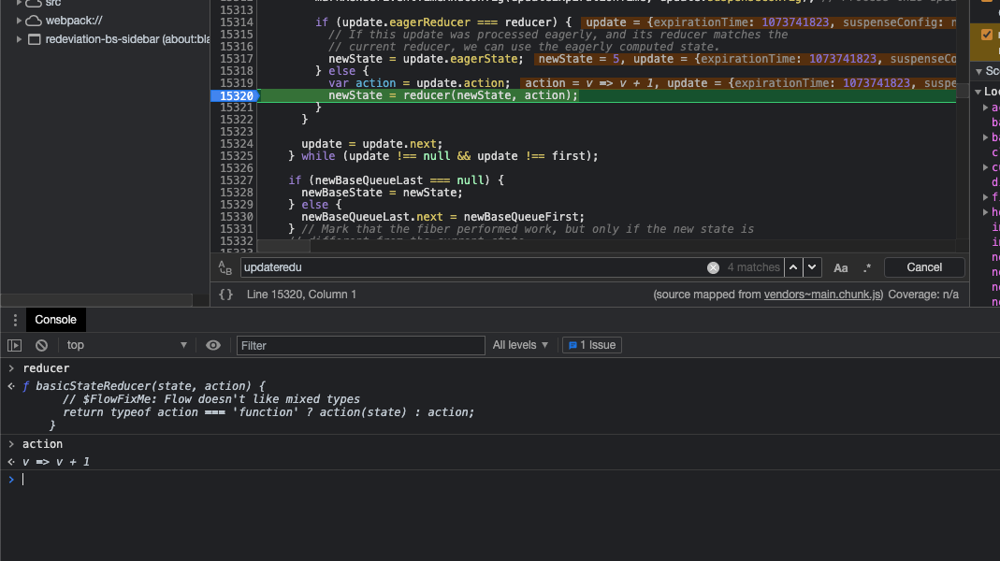

# 二面
- redux的state为什么不可以直接修改, 而需要浅拷贝或者immutable-helper处理.
    - 这个想问是react的什么机制导致要这样, 答得浅比较, 不是很清楚标准答案怎么讲, 比如为什么会重渲染? 
        - [原因](https://zh-hans.reactjs.org/docs/update.html) 官方说如果使用不可变数据, 可以使shouldComponentUpdate判断地比较快; 另外深拷贝比较耗时, 所以有immutable-helper, 可以比较快地拷贝一份.
        - [immutable](https://daveceddia.com/react-redux-immutability-guide/)
        - [补充一下为啥不能直接修改this.state](https://daveceddia.com/why-not-modify-react-state-directly/) 感觉主要是让state变得不可预测.
    - 还答得另一个地方在用同一个引用, 直接修改可能使使用者出现问题;
- hook读代码, 并改写成count递增的
    - 追问为啥这么改就可以(想问hook更新机制);
    - 再追问 最后这样有什么不好的地方, 我问了下什么方面的? 提示了一下垃圾回收方面的,  那useEffect应该return一个destory函数
    
    追问1的demo: <br/>  <br/>
    在updateReducer断点并点击setState: <br/>
```diff
function FC() {
    const [count, setCount] = useState(0);
    useEffect(() =>{
        setInterval(() =>{
-            setCounter(count + 1) // count always 0
+            setCounter(v => v + 1)
        }, 100)
    }, [])
    return <div>{count}</div>;
}
```
- hook有遇到什么坑
    - 答了闭包陷阱和useCb带来的隐式依赖
- 设计一个组件: 请求有loading状态也可能失败, 设计一个组件让可以复用展示loading和失败状态的.
    - 写了个classcomponent 用renderProps接data, 用props.fechter(): PromiseLike<{data: any}>去请求.
    - 追问 能否用FC写一个, 我说理论上可以, 他说不可以, 要实现的这个东西是高层的组件 (没太明白啥意思, 大家有想法可以补充一下), 理论上用usememo缓存个render结果应该可以.
    - 会问类型是什么, 比如render的 fetcher的
```ts
// 我写的
interface IProps {render: (data: any) => React.ReactNode, fetcher: () => Promise<any>}}
class A extends React.Component<IProps,  {
    isLoading: boolean;
    isError: boolean;
    data: any;
}> {
    constructor(props){
        super(props);
        this.state = {
            isLoading: true,
            isError: false,
            data: null;
        }
    }

    componentDidMount = () => {
        // 被追问fecher怎么穿参, 我反驳道 fetcher里自己处理好了, 这个组件貌似没有需要传给它的东西
        this.props.fetcher().then(res =>{
            this.setState({isLoading: false, data: res})
        }).catch(e =>{
            this.setState({isLoading: false, isError: true})
        })
    }
    render() {
        return this.state.isLoading? "loading" : this.state.isError?"error":this.props.render(this.state.data)
    }
}

```
- 先写一个斐波那契数列的生成函数: function fib(index: number): number, 然后写一个请求失败重试函数, 重试前延时fib(i); 说是前边失败次数很多, 后边失败的概率会加大, 可能要多等一会, 这种场景.
```ts
    fetch(options: any): PromiseLike<any>;
    // 实现
    retryFetch(options: any, count: number): PromiseLike<any>

```
- 设计个组件 Modal: 1. mask层和content层怎么写样式, 并且要求滚动时, content始终保持在视口的位置; 2. 如何绑定事件, mask点击后就隐藏, 而点击modal主体部分不会隐藏.
    - 看看antd的实现吧. 盲答得 fixed定位, 在mask上绑定一个click事件, 并且判断target是mask
- 有什么想问的
